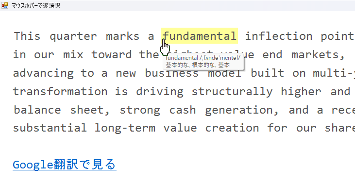

英文を単語単位で辞書参照しながら読むための軽量ツール (Windows用) です。

(スクリーンショット↓)

## 特徴

- マウスホバーで単語の発音記号と意味を表示

- ローカル動作ですが、Google翻訳へのリンクを文末につけるようにしてます

## ライセンス

- program code : MIT License

- dictionary DATA (`en-ja.json`) : CC BY-SA 4.0

※ 辞書データは作者による独自編集ですが、Wiktionary 等の公開資料を参考に作成しています。

## 使用技術

- C#

- WinForms

## 辞書データ

本ソフトに含まれる en-ja.json は、作者が作成した英和辞書データです。
辞書データは本ソフト向けにパブリックドメインの（著作物性のない）言語情報を独自編集したものであり、外部辞書データの完全転載を目的としたものではありません。

また、本ソフトは Google翻訳へのリンクを生成しますが、翻訳結果の取得・保存などを目的とするものではありません。問題等がありましたら、確認のうえ適宜対応します。  

  
英単語の発音表記および代表的な語義の整理にあたり、特に以下のサイト様を参考にさせていただきました。ありがとうございます。

- 天才英単語　https://tentan.jp/

- Wiktionary　https://ja.wiktionary.org/wiki/Wiktionary

